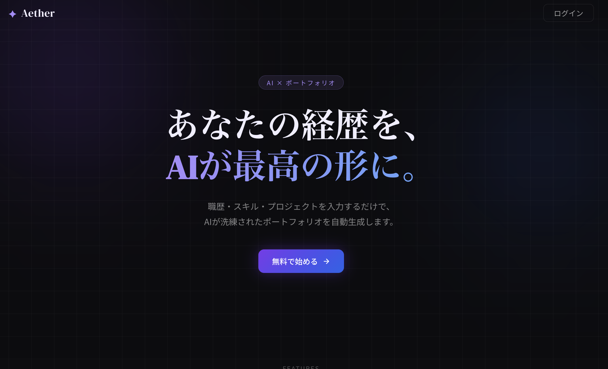
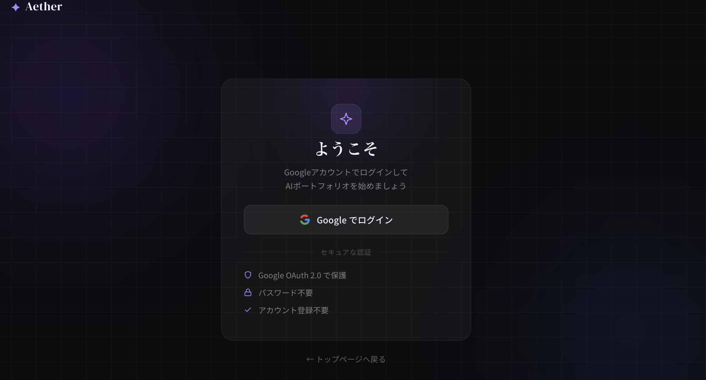
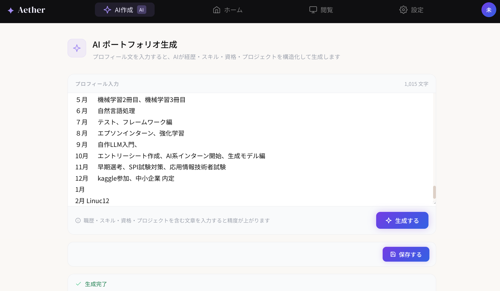
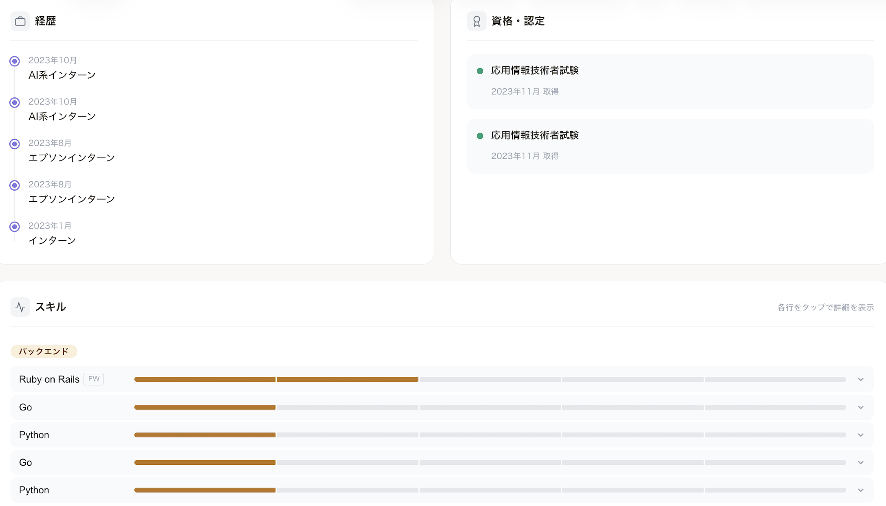
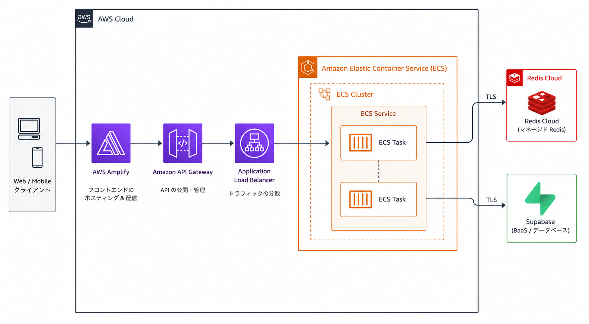

# エンジニア向けポートフォリオ作成アプリ

### AIによる自動作成機能を搭載したフルスタックWebアプリケーション

## URL https://main.d2h20uv0fglos5.amplifyapp.com
Spring BootとNuxt.jsを組み合わせ、Googleログインによる認証と、AI（LLM）を活用した自動生成機能を統合したポートフォリオ作品です。

---

## デモ画面
### ホーム、ログイン画面

---
### googleログイン画面

---
### ログイン後の画面、AI生成ページ

---
### ポートフォリオ閲覧ページ


## 💎 サービス概要

エンジニアのポートフォリオ作成を支援するためのWebアプリケーションです。  
ユーザーはGoogleアカウントで簡単にログインし、AIが自動生成するコンテンツを活用して、魅力的なポートフォリオを作成できます。

---

## 🚀 主な機能

- **Google OAuth 2.0 ログイン**
   - 面倒な会員登録なしで、Googleアカウントですぐに利用可能。

- **AI自動生成エンジン**
   - Spring AIを利用し、OpenAI / Gemini / Claude などの最新AIモデルと連携。

- **生成履歴管理**
   - 過去に生成したコンテンツの保存、編集、削除。

- **リアルタイム・プレビュー**
   - AIが生成する過程を直感的に確認できるUI。

- **レスポンシブ対応**
   - PC・スマホ両方で快適に利用可能。

---

## 🛠 技術スタック

### フロントエンド
- Framework: Nuxt 3 (Vue.js 3)
- State Management: Pinia
- Styling: Tailwind CSS / Nuxt UI
- Package Manager: npm

### バックエンド
- Framework: Spring Boot 3.x
- Language: Java 21
- Security: Spring Security (OAuth 2.0 Client)
- Database: PostgreSQL (Supabase / Render)
- Build Tool: Gradle

---

## ☁️ AWS構成について


## 🏗 システム構成

### 1. Frontend (Nuxt.js)
- ユーザーインターフェース
- API通信による非同期データ処理

### 2. Backend (Spring Boot)
- REST APIの提供
- Google認証のハンドリング
- ビジネスロジックの実行

### 3. AI Service
- Spring AIを介した生成AI APIとの連携

### 4. Database (PostgreSQL)
- ユーザー情報および生成結果の永続化

---


### 構成概要

- **AWS Amplify**
   - Nuxt.js フロントエンドをホスティング
   - GitHub連携による自動デプロイに対応
   - HTTPS化されたURLで外部公開可能

- **Amazon API Gateway**
   - フロントエンドとバックエンド間のAPIエンドポイントを管理
   - REST APIとしてSpring Bootと接続

- **Application Load Balancer (ALB)**
   - ECSへトラフィックを分散
   - 将来的なスケールアウトにも対応

- **Amazon ECS (Fargate)**
   - Spring Boot APIサーバーをコンテナ運用
   - Dockerベースで環境差異を最小化

- **Redis Cloud**
   - キャッシュ用途として利用
   - AI生成結果やセッション管理を高速化

- **Supabase (PostgreSQL)**
   - ユーザー情報や生成履歴を永続化
   - 認証データやポートフォリオ情報を保存

---

## 🌐 外部公開について

AWS Amplifyによって生成されるURLを利用することで、第三者へポートフォリオを公開可能です。


## 📌 この構成のポイント

- フロントエンドとAPIを分離し保守性を向上
- ECSによるコンテナ化でデプロイを効率化
- API Gateway + ALB構成で拡張性を確保
- Supabaseを利用してDB運用コストを削減
- AmplifyによりCI/CDと外部公開を簡略化

---

## 🏃 起動方法

### バックエンド (Spring Boot)

```bash
cd backend
./gradlew bootRun
```

### フロントエンド (Nuxt.js)

```bash
cd frontend
npm install
npm run dev
```

---

